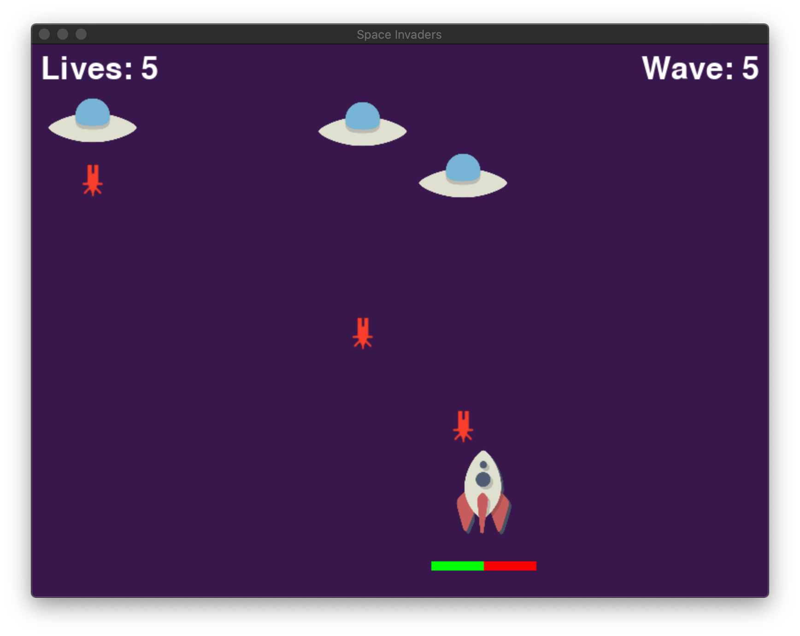
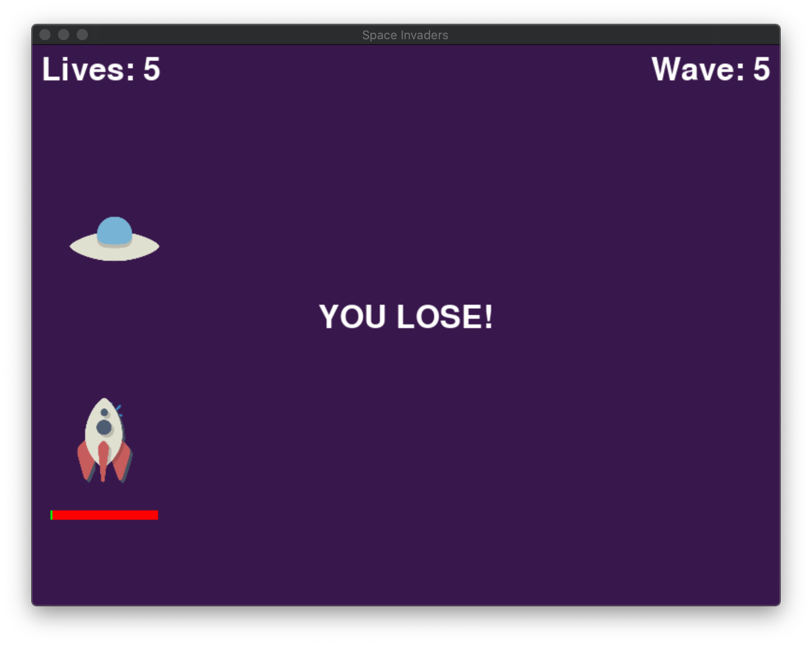

# python-spaceInvaders

Space Invaders implemented in python with Pygame

## Getting Started

These instructions will get you a copy of the project up and running on your local machine for testing purposes.

### Prerequisites

- A working command line

### Installing and Running

Download the zip then create a virtual environment and install the dependencies from requirements.txt 

Make sure you have `virtualenv`

```console
foo@bar:~$ pip3 install virtualenv
```

Navigate to the correct directory then create and source a virtual environment and install the dependencies

```console
foo@bar:~$ cd /path/to/directory/here
foo@bar:~$ virtualenv venv
foo@bar:~$ source venv/bin/activate
(venv) foo@bar:~$ pip install -r requirements.txt
```

Finally, to run the program, run the following command

```console
(venv) foo@bar:~$ python invader.py
```

Examples:



## Authors

* **Michael Roush** - *Project completion*

## License

Copyright © 2020 Michael Roush. All rights reserved.